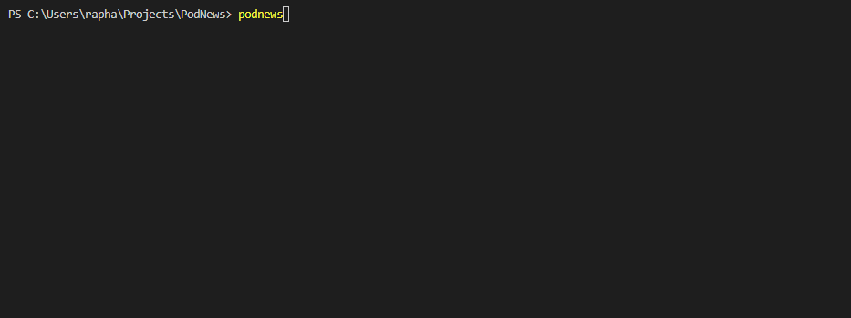

# Podnews

<p align="center">
  
  
</p>

Noticias diárias feitas por um(s) robô(s). O projeto foi inspirado tanto no projeto do [Podbot](https://github.com/lhcgoncalves/podbot) do Luiz Gonçalves, quanto no projeto [Video-Maker](https://github.com/filipedeschamps/video-maker) do Felipe Deschamps. O foco é criar um podcast de notícias diárias de forma automática.



# Desenvolvendo

Ainda **NÃO** é possível baixar o CLI, pois está em fase de desenvolvimento.

```
    // baixando o repositório
    git clone (este repositório)

    // instalando as dependencias
    npm install

    // criando um link simbólico para funcionar de forma global
    npm link
```

## Configurando o projeto

O projeto utilizando várias API's que são necessárias, vamos precisar de:

- Copiar o arquivo `.env.example` para `.env` 
- [Credencial da Google](https://github.com/googleapis/nodejs-speech#using-the-client-library) siga os passos desse repositório, baixe o json e coloque o caminho pra esse arquivo no `.env`
- [Google NEWS](https://newsapi.org/docs/get-started) apenas crie uma conta e cole sua KEY dentro do `.env`

## CASO você queira gerar a thumb

- [Google IMAGE](https://github.com/vadimdemedes/google-images#set-up-google-custom-search-engine) siga os passos desse repositório, cole o `CSE ID` em `GOOGLE_IMAGES_CSE_KEY` e o `API KEY` em `GOOGLE_KEY` também no `.env`

**QUALQUER dúvida crie uma issue que irei ajudar.**

# Contribuindo
- Crie uma branch assim `meu-nome/minha-funcionalidade`
- Trabalhe nela e de git pull ao finalizar

# Acompanhe o progresso

[Todolist](https://github.com/raphaelkieling/PodNews/issues/1)
